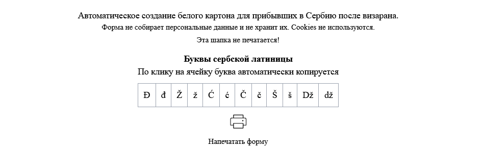
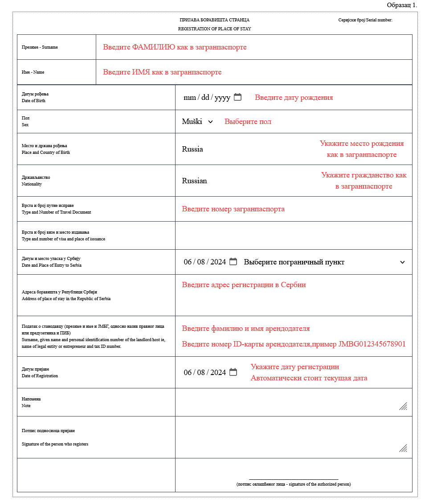

# Foreign citizen residence registration form in Serbia (Beli karton)

## Overview

This is a simple web application designed to simplify the process of filling out the "Foreign Citizen Residence Registration" form in Serbia, commonly known as "Beli Karton," for Russian-speaking people. The language of the app is Russian. Users can fill in the necessary details online, print the form, or save it to send for printing. The application does not collect or store any personal information, ensuring user privacy.

## Table of Contents
- [Links](#links)
- [Features](#features)
- [Technologies](#technologies)
- [Screenshots](#screenshots)
- [Installation](#installation)
- [Contributing](#contributing)

## Links

Deploy: [https://beli-karton.vercel.app/](https://beli-karton.vercel.app/)

## Features

- Fill out the registration form online.
- Include specific letters of the Serbian latin alphabet for easy input. Users can click on a character to automatically copy it to the clipboard.
- Automatically set today's date for relevant form fields.
- Provide a list of places of entry in Serbia for easy selection.
- Print the completed form directly from the application.
- Save the form for printing later.
- No data collection or storage, ensuring user privacy.


## Technologies

- React
- Typescript
- Tailwind CSS

## Screenshots

<b>Header</b>

<details><summary><b>Show all</b></summary>
<b>Form</b>

</details>

## Installation

1. **Clone the repository:**

    ```bash
    git clone https://github.com/IrinaGarmaeva/beli-karton.git
    ```

2. **Install dependencies:**

    ```bash
    npm install
    ```

3. **Start the development server:**

    ```bash
    npm run dev
    ```

    This will start the application on `http://localhost:5173`.


4. **Build app (production):**

    ```bash
    npm run build
    ```

## Contributing

If you have any suggestions or improvements, feel free to open an issue or create a pull request.
